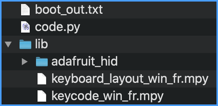

## Keyboard Layouts For Circuitpython

The goal of this repository is to contain a list of keyboard layouts for use with the Circuitpython [`adafruit_hid`](https://github.com/adafruit/Adafruit_CircuitPython_HID) library, that can be used as a reference for international keyboards and can be distributed as a "bundle" in the style of the Adafruit bundle.

It can be used with circup for easy installation.

```
circup bundle-add Neradoc/Circuitpython_Keyboard_Layouts
circup install keyboard_layout_win_fr keycode_win_fr
```

NOTE: for pico-ducky users, [there's a dedicated guide](PICODUCKY.md).

## Install your language

To install both the layout and keycode files for your language, you need to copy 3 files to your board. Pick the language and platforms that match yours. Use the `.py` version, or the `.mpy` version matching your version of Circuitpython. The mpy files take less space and are better suited for Circuitpython boards with less than 1MB of drive.

- `keyboard_layout.mpy` (support file)
- `keyboard_layout_win_fr.mpy` (pick your platform/language)
- `keycode_win_fr.mpy` (pick your platform/language)

The files go directly in the directory called "**lib**" on the board.



## Use the libraries

### Layouts

Layouts require first installing the `keyboard_layout` module (`keyboard_layout.mpy` in the bundle zip), containing the base class for the layouts. This file should be part of adafruit_hid in the future and will then be removed.

For the plaform **platform** (win, mac) and the layout language **lang**. The module `keyboard_layout_platform_lang` has a class called `KeyboardLayout`. It contains the layout information for use with the `Keyboard` to type text.

```py
import usb_hid
from adafruit_hid.keyboard import Keyboard
from keyboard_layout_win_fr import KeyboardLayout
keyboard = Keyboard(usb_hid.devices)
layout = KeyboardLayout(keyboard)
layout.write("Bonjour le monde")
```

Switching layouts on start can be done by conditionally importing a different layout module, or renaming the imported layout class like this for example:

```py
from keyboard_layout_win_fr import KeyboardLayout as LayoutFR
from keyboard_layout_win_de import KeyboardLayout as LayoutDE
```

### Keycodes

`keycode_<platform>_<lang>` modules are an attempt to make it easier to swap layouts. While keycode numbers are really physical positions on a keyboard, HID Keycodes normally reference the US keyboard for key names. These localized keycodes offer a level of conversion allowing to use `Keycode.A` across azerty and qwerty keyboards for example. It won't swap `control` and `command` to match the platform however. (A helper module could do that).

```py
if IS_AZERTY:
	from keycode_mac_fr import Keycode
else:
	from adafruit_hid.keycode import Keycode

kbd.send(Keycode.COMMAND, Keycode.A)
```

## Helpers

The `consumer_control_extended` module brings a big list of names for the consumer controls page in the HID specs, to be used with `adafruit_hid.consumer_control`.

## The Layout Generator

This needs to be further documentend, but for now `tests/make_validated.sh` shows an example of how to use it. There is a live version of the web generator, though it might not always be the current release.

https://www.neradoc.me/layouts/
